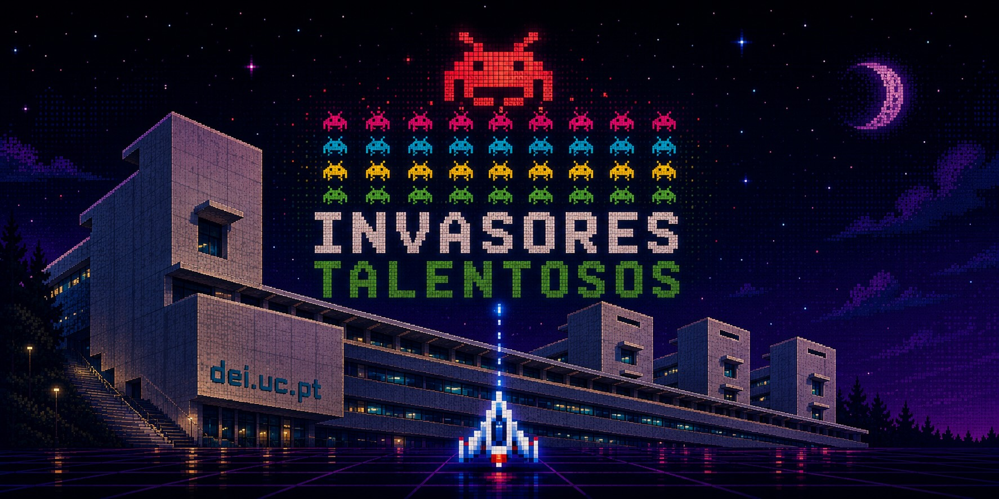

# Invasores Talentosos

Projeto final do programa [Talento@DEI 2026](https://www.uc.pt/fctuc/dei/talento/). Este repositório serve de ponto de partida para os alunos adaptarem o jogo de forma a controlarem as naves através de sensores EMG.

## Instalar dependências

```bash
pip install -r requirements.txt
```

## Correr o jogo

```bash
python main.py
```

Isto inicia o jogo e a API em simultâneo.

### Teclas

| Tecla | Ação |
|---|---|
| S | Iniciar jogo |
| P | Pausar / retomar |
| R | Reiniciar |
| ESC | Sair |

| Jogador A | Jogador B |
|---|---|
| W / S — mover | ↑ / ↓ — mover |
| SPACE — disparar | ENTER — disparar |
| LSHIFT — bloquear oponente | RSHIFT — bloquear oponente |

## Correr o controlador

O controlador é uma janela com 4 botões que envia comandos à API via HTTP.

Antes de correr, editar as constantes no topo do ficheiro `controller.py`:

```python
PLAYER_ID = "a"
API_HOST  = "localhost"
API_PORT  = 8000
```

Depois:

```bash
python controller.py
```

## Configuração

Todas as opções do jogo estão em `config.yaml`.
